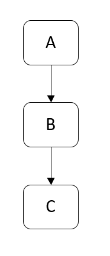

# 优雅地面对龟速

大山信号差，我要上网，怎么办？

---

### 技术涉及
- adb 
- fiddler
- hawk
- doze
- workmanager

---

### 还原背景
- 小区楼盘位置偏僻，信号覆盖率差（弱网）
- 经常要去地下车库，完全没信号
- 需要联网拉取数据，上报数据

---

### 开始解决
- 模拟测试
- 持久化存储
- 延迟上传数据


---

### 工具
磨刀不误砍柴工

#### adb 

adb(Android Debug Bridge) 安卓调试桥，包含adb client、adb server和adbd三部分。


```
bogon:~ wenweichen$ adb
Android Debug Bridge version 1.0.40
Version 4986621
Installed as /Users/wenweichen/Library/Android/sdk/platform-tools/adb

global options:
 -a         listen on all network interfaces, not just localhost
 -d         use USB device (error if multiple devices connected)
 -e         use TCP/IP device (error if multiple TCP/IP devices available)
 -s SERIAL  use device with given serial (overrides $ANDROID_SERIAL)
 -t ID      use device with given transport id
 -H         name of adb server host [default=localhost]
 -P         port of adb server [default=5037]
 -L SOCKET  listen on given socket for adb server [default=tcp:localhost:5037]
```


```
adb -s emulator-5556 install yylite.apk

adb install [-lrtsdg] <path_to_apk>
(-l: 锁定该程序)
(-r: 重新安装该程序，保留应用数据)
(-t: allow test packages)
(-s: 将应用安装到 SD卡，不过现在手机好像都没有 SD卡 了吧)
(-d: 允许降版本号安装，当然只有 debug 包才能使用)
(-g: 安装完默认授予所有运行时权限，这个应该对 Android 6.0 及之后的版本才有效吧)
```


##### am
```
bogon:android-workmanager eve$ adb shell am start -W -n com.yy.yylite/.MainActivity
Starting: Intent { cmp=com.yy.yylite/.MainActivity }
Status: ok
Activity: com.yy.yylite/.MainActivity
ThisTime: 933
TotalTime: 933
WaitTime: 960
Complete
bogon:android-workmanager eve$ adb shell am start -W -n com.yy.yylite/.MainActivity
Starting: Intent { cmp=com.yy.yylite/.MainActivity }
Warning: Activity not started, its current task has been brought to the front
Status: ok
Activity: com.yy.yylite/.MainActivity
ThisTime: 104
TotalTime: 104
WaitTime: 122
Complete
bogon:android-workmanager eve$ adb shell am force-stop com.yy.yylite
bogon:android-workmanager eve$ 
```


```
adb shell am broadcast -a com.android.test --es test_string "this is test string" --ei test_int 100 --ez test_boolean true
－es 是传递String参数，test_string 参数key    "this is test string" 是参数值
－ei 是传递int参数，test_int 参数key    10 是参数值 
－ez 是传递boolean参数，test_boolean 参数key    true是参数值
```


##### pm
```
bogon:android-workmanager eve$ adb shell
HWCOL:/ $ pm path com.yy.yylite
package:/data/app/com.yy.yylite-G3bJWI7fq2hQeVY1pKWkQg==/base.apk
HWCOL:/ $ pm clear com.yy.yylite
Success
```
##### wm

```
HWCOL:/ $ wm size
Physical size: 1080x2280
HWCOL:/ $ wm density
Physical density: 480
```

##### other.....

```
adb shell screencap /sdcard/screen.png
adb shell screenrecord /sdcard/demo.mp4
adb shell bmgr backup <package> 
adb shell bmgr restore <package> 
logcat ..
```

### Fiddler
> 通过fiddler来模拟限速，因为fiddler本来就是个代理，它提供了客户端请求前和服务器响应前的回调接口，我们可以在这些接口里 面自定义一些逻辑。Fiddler的模拟限速正是在客户端请求前来自定义限速的逻辑，此逻辑是通过延迟发送数据或接收的数据的时间来限制网络的下载速度和 上传速度，从而达到限速的效果。


```
1.Hide Image Requests---隐藏图片请求

2.Hide HTTPS CONNECTs---隐藏HTTPS连接

3.Automatic Breakpoints---自动设置断点

>Before Requests---在请求前设置断点，快捷键F11

>After Response---在响应后设置断点，快捷键Alt + F11

>Disabled---不自动设置断点，快捷键Shit + F11

>Ignore Images---自动设置断点时忽略图片

4.Customize Rules...---自定义规则，快捷键Ctrl + R

5.Require Proxy Authentication---需要代理密码验证

6.Apply GZIP Encoding---应用GZIP压缩

7.Remove All Encoding---移除全部编码

8.Hide 304s---隐藏所以状态未304（无变更）的请求

9.Request Japanese Content---请求日文内容

10.User-Agents---选择用户Web客户端代理类型，包括了目前主流浏览器

11.Performance---性能

>Simulate Modem speeds---模拟调制解调器速度

>Disable Caching---禁止缓存

>Cache Always Fresh---新的缓存

```

---


### Hawk

Initialize

```
Hawk.init(context).build();
```

Usage
Save any type (Any object, primitives, lists, sets, maps ...)

```
Hawk.put(key, T);
```

Get the original value with the original type


```
T value = Hawk.get(key);
```

Delete any entry


```
Hawk.delete(key);
```

Check if any key exists


```
Hawk.contains(key);
```

Check total entry count


```
Hawk.count();
```

Get crazy and delete everything


```
Hawk.deleteAll();
```

More option


```
Hawk.init(context)
  .setEncryption(new NoEncryption())
  .setLogInterceptor(new MyLogInterceptor())
  .setConverter(new MyConverter())
  .setParser(new MyParser())
  .setStorage(new MyStorage())
  .build();
```


---

### Doze 低电耗模式
Android系统引入了OOM Killer 来解决内存资源被耗尽的问题，。OOM killer是依据系统空闲的内存空间大小和oom_adj阈值的组合规则来杀死进程的。根据adj的值，如果
我们的应用消耗的内存越少，它被系统强行杀死的可能性越小，也就是说该应用存活的时间越长。

> 从 Android 6.0（API 级别 23）开始，Android 引入了两个省电功能，可通过管理应用在设备未连接至电源时的行为方式为用户延长电池寿命。低电耗模式通过在设备长时间处于闲置状态时推迟应用的后台 CPU 和网络 Activity 来减少电池消耗。应用待机模式可推迟用户近期未与之交互的应用的后台网络 Activity。

如果用户设备未插接电源、处于静止状态一段时间且屏幕关闭，设备会进入低电耗模式。 在低电耗模式下，系统会尝试通过限制应用对网络和 CPU 密集型服务的访问来节省电量。 这还可以阻止应用访问网络并推迟其作业、同步和标准闹铃。

系统会定期退出低电耗模式一会儿，好让应用完成其已推迟的 Activity。在此维护时段内，系统会运行所有待定同步、作业和闹铃并允许应用访问网络。


> 2018年8月: 所有新开发应用的target API level必须是26(Android 8.0)甚至更高。

> 2018年11月: 所有已发布应用的target API level必须更新至26甚至更高。

> 2019年起:   在每一次发布新版本的Android系统之后，所有新开发以及待更新的应用都必须在一年内将target API level调整至对应的系统版本甚至更高。

我们所熟知的Servcie已经被弃用了，因为它不再被允许在后台执行长时间的操作，而这却是它最初被设计出来的目的。

电池状态
```
bogon:~ eve$ adb shell dumpsys battery
Current Battery Service state:
  AC powered: false
  USB powered: true
  Wireless powered: false
  Max charging current: 500000
  Max charging voltage: 5024000
  Charge counter: 4
  status: 5
  health: 2
  present: true
  level: 100
  scale: 100
  voltage: 4364
  temperature: 290
  technology: Li-poly
```


模拟手机未充电状态

```
bogon:~ eve$ adb shell dumpsys battery unplug
```

```
bogon:~ eve$ adb shell dumpsys battery
Current Battery Service state:
  (UPDATES STOPPED -- use 'reset' to restart)
  AC powered: false
  USB powered: false
  Wireless powered: false
  Max charging current: 500000
  Max charging voltage: 5024000
  Charge counter: 4
  status: 5
  health: 2
  present: true
  level: 100
  scale: 100
  voltage: 4364
  temperature: 290
  technology: Li-poly
```


让IDLE有效化

```
adb shell dumpsys deviceidle enable
```

关闭IDLE状态

```
bogon:~ eve$ adb shell dumpsys deviceidle disable
Deep idle mode disabled
Light idle mode disabled
```

重置电池

```
adb shell dumpsys battery reset
```


- 通过运行以下命令强制应用进入应用待机模式：

```
 $ adb shell dumpsys battery unplug
 $ adb shell am set-inactive <packageName> true
```

- 使用以下命令模拟唤醒应用：

```
$ adb shell am set-inactive <packageName> false
$ adb shell am get-inactive <packageName>
```

---

### Workmanager

##### 相关的方案：
- AlarmManager
- JobScheduler
- Firebase JobDispatcher
- GCM 网络管理工具

##### 为何选择Workmanager
##### 1. easy to schedule
    1.可以延迟的异步任务，
    2.可以指定何时，何状态（充电/网络）
    3.可以并行或者顺序执行
    4.应用强制退出或者重启，也可以执行
##### 2. easy to cancel
    每个任务分配了唯一的UUID，API直接取消
##### 3. easy to query
    运行、挂起、已完成等
    例如上传图片，可以显示百分比
    可以观察这个LiveData
##### 4. support all version
    支持所有的android版本


#### androidx.work.*组件
-   API 23+
    -   使用 JobScheduler
-   API 14-22
    -   如果app用了Firebase JobDispatcher的依赖，就用它
    -   否则使用 AlarmManager + BroadcastReceiver 
##### WorkManager
> 接收带参数和约束条件的WorkRequest，并将其排入队列。

##### Worker
> 需要实现doWork()这一个方法，它是执行在一个单独的后台线程里的。所有需要在后台执行的任务都在这个方法里完成。

##### WorkRequest
> 给Worker设置参数和约束条件（是否联网、是否接通电源）等；周期还是一次性等

##### WorkResult
> Success, Failure, Retry.

##### Data
>传递给Worker的持久化的键值对。


##### for example 
##### 创建Worker

```
class CompressWorker : Worker() {
    override fun doWork(): Worker.Result {
        doCompress()
        return Worker.Result.SUCCESS
    }

```

##### 添加条件
```
val mConstraints = Constraints.Builder()
        .setRequiresBatteryNotLow(true)//不在电量不足时执行
        .setRequiresCharging(true)//在充电时执行
        .setRequiresStorageNotLow(true)//不在存储容量不足时执行
        .setRequiresDeviceIdle(true)//在待机状态执行
        .build()
```

##### 执行
```
//1.约束条件
val mConstraints = Constraints.Builder().setRequiredNetworkType(NetworkType.CONNECTED).build()
//2.传入参数
val mData = Data.Builder().putString("demo", "helloworld").build()
//3.构造work
val mCompressWork =
OneTimeWorkRequest.Builder(CompressWorker::class.java).setConstraints(mConstraints).setInputData(mData).build()
//4.放入执行队列
WorkManager.getInstance().enqueue(mCompressWork)
```

##### 周期执行


```
val periodicWorkRequest = PeriodicWorkRequest.Builder(CompressWorker::class.java, 15, TimeUnit.SECONDS).setConstraints(myconstraints).setInputData(data).build()
```

##### 取消任务

```
val compressionWorkId:UUID = compressionWork.getId()
WorkManager.getInstance().cancelWorkById(compressionWorkId)
```

##### 观察任务
```
WorkManager.getInstance().getStatusById(compressionWork.id)
                .observe(lifecycleOwner, Observer { workStatus ->
                    // Do something with the status
                    if (workStatus != null && workStatus.state.isFinished) {
                        // ...
                    }
                })
```
除了使用LiveData观察，还可以通过调用getOutputData()来读取输出数据
##### 标记Work

```
WorkRequest.Builder.addTag()
```

##### 任务链
顺序执行
```
graph LR
A-->B
B-->C
```


```
WorkManager.getInstance().beginWith(A).then(B).then(C).enqueue();
```

> OneTimeWorkRequest后跟另一个OneTimeWorkRequest，第一个任务通过调用setOutputData()返回结果，下一个任务通过调用getInputData()来获取结果

满足A,B，再执行
```
graph LR
A-->C
B-->C
```

```
WorkManager.getInstance().beginWith(A,B).then(C).enqueue();
```

任务链1和2执行完，再执行


```
graph TB
A-->B
C-->D
B-->E
D-->E
```

```
val workContinuation1 = WorkManager.getInstance().beginWith(A).then(B)
val workContinuation2 = WorkManager.getInstance().beginWith(C).then(D)
val workContinuation3 = WorkContinuation.combine(workContinuation1, workContinuation2).then(E)
workContinuation3.enqueue()

```

